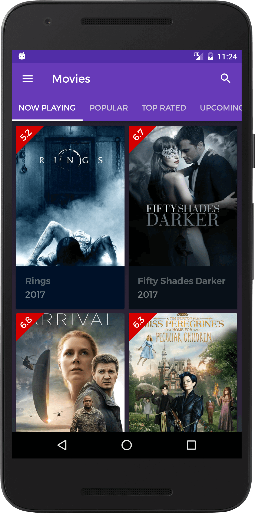
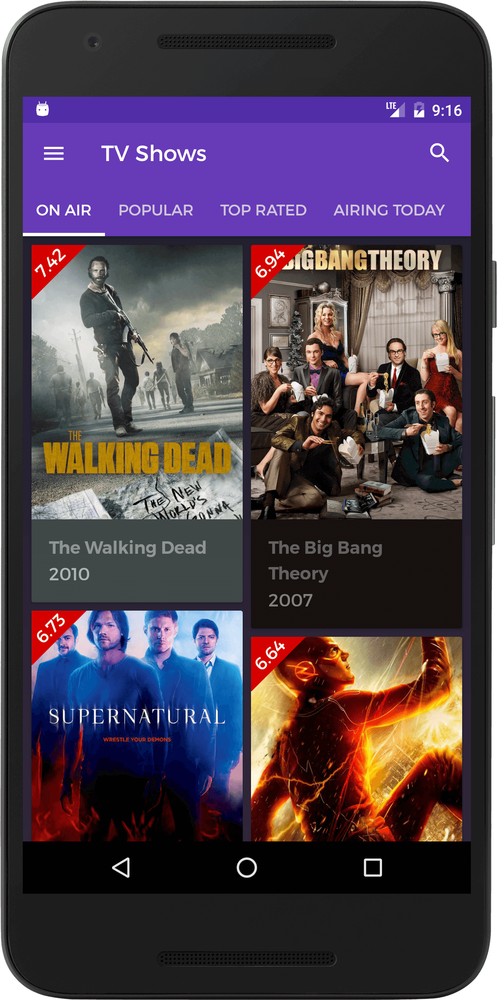
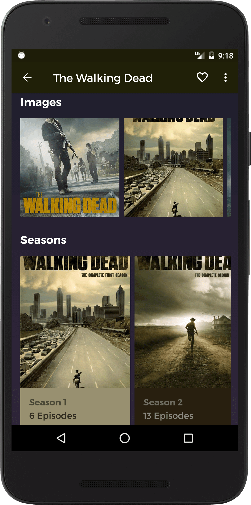

# Movie Guide

Movie Guide is an open source Android application for [TMDb](https://www.themoviedb.org). It showcases detailed information about movies, tv shows and actors from TMDb.

[](https://www.android.com)
[](https://github.com/AshishKayastha/Movie-Guide#license)
[](https://android-arsenal.com/api?level=21)
[](http://makeapullrequest.com)

## Features
* Material design with delightful animations.
* Minimal and simple user interface, which user can get easily acquainted with.
* View movies, tv shows and actors information from TMDb.
* Search and filter your favorite movies, tv shows and people.
* View movie and tv show ratings from OMDb.

## Libraries and tools included:
* Support libraries
* RecyclerView and CardView
* Palette
* Custom Tabs
* [Kotlin](https://kotlinlang.org/)
* [RxJava 2](https://github.com/ReactiveX/RxJava) and [RxAndroid 2](https://github.com/ReactiveX/RxAndroid) 
* [Retrofit 2](http://square.github.io/retrofit/)
* [Dagger 2](http://google.github.io/dagger/)
* [StorIO](https://github.com/pushtorefresh/storio)
* [KotterKnife](https://github.com/JakeWharton/kotterknife)
* [Timber](https://github.com/JakeWharton/timber)
* [Glide](https://github.com/bumptech/glide/)
* [Paper Parcel](https://github.com/grandstaish/paperparcel)
* [Ice Pick](https://github.com/frankiesardo/icepick)
* [Leak Canary](https://github.com/square/leakcanary)

## Screenshots







## Configuration

In order to run this application, you need to get your own key from TMDb. You can do that by clicking [here](https://www.themoviedb.org/account/signup).</br>

After you get an API key, put that key in `gradle.properties` file as follows:
```
TMDB_API_KEY="your_api_key"
```
</br>
Now you can run the app by clicking *Run -> Run 'app'*.

## Contributing
You can contribute to the project by either finding out bugs or by requesting new features. Any contributions are welcome!

## License

```
Copyright 2017 Ashish Kayastha

Licensed under the Apache License, Version 2.0 (the "License");
you may not use this file except in compliance with the License.
You may obtain a copy of the License at

   http://www.apache.org/licenses/LICENSE-2.0

Unless required by applicable law or agreed to in writing, software
distributed under the License is distributed on an "AS IS" BASIS,
WITHOUT WARRANTIES OR CONDITIONS OF ANY KIND, either express or implied.
See the License for the specific language governing permissions and
limitations under the License.
```
